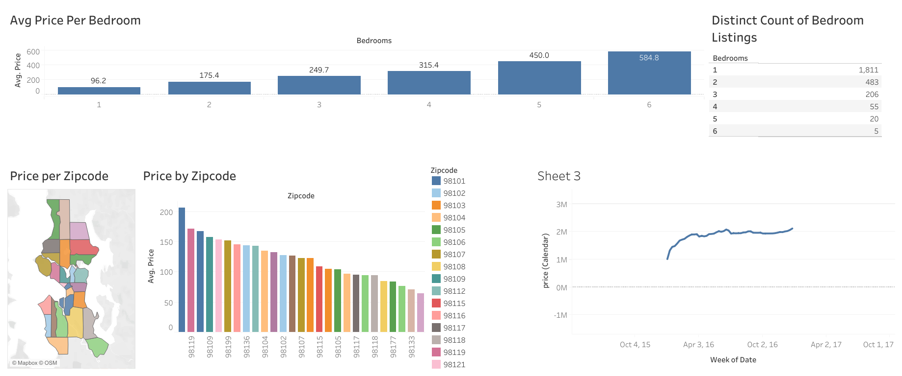

# Airbnb Data Analysis Dashboard

## 📊 Project Overview
This project analyzes Airbnb listings data to uncover pricing patterns, demand trends, and location-based insights.

---

## 🔍 Key Insights
- Prices increase with number of bedrooms  
- 1–2 bedroom listings have high competition  
- 5–6 bedroom listings have higher price potential  
- Premium zipcodes: 98101, 98102  
- Budget areas: 98178, 98168  

---

## 📸 Dashboard Preview

---

## 🔗 Live Dashboard
https://public.tableau.com/app/profile/adeeb.moizuddin/viz/AirBnBMiniProject_17651885624500/Dashboard1

---

## 💡 Business Value
- Helps hosts optimize pricing  
- Helps investors find profitable areas  
- Helps travelers find affordable stays  

---

## 🛠 Tools Used
- Tableau Public  
- Excel / CSV  
